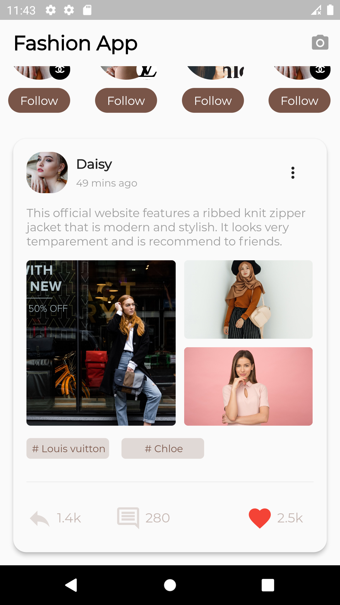

# fashion_app_ui_design
                                                                                                                    

<h3>I made the structure that can be scrolled horizontally, showing the recommended users to follow.</h3>

<h3>I made a card image of shared posts.</h3>

<h3>
I applied the animation(Hero) that will be applied when clicking on the pictures in the shared post and going to the detail page and returning to the sharing section.
</h3>

<h3>First view of the detail page.</h3>

<h3>Last view of the detail page.</h3>

## Getting Started

This project is a starting point for a Flutter application.

A few resources to get you started if this is your first Flutter project:

- [Lab: Write your first Flutter app](https://docs.flutter.dev/get-started/codelab)
- [Cookbook: Useful Flutter samples](https://docs.flutter.dev/cookbook)

For help getting started with Flutter development, view the
[online documentation](https://docs.flutter.dev/), which offers tutorials,
samples, guidance on mobile development, and a full API reference.
